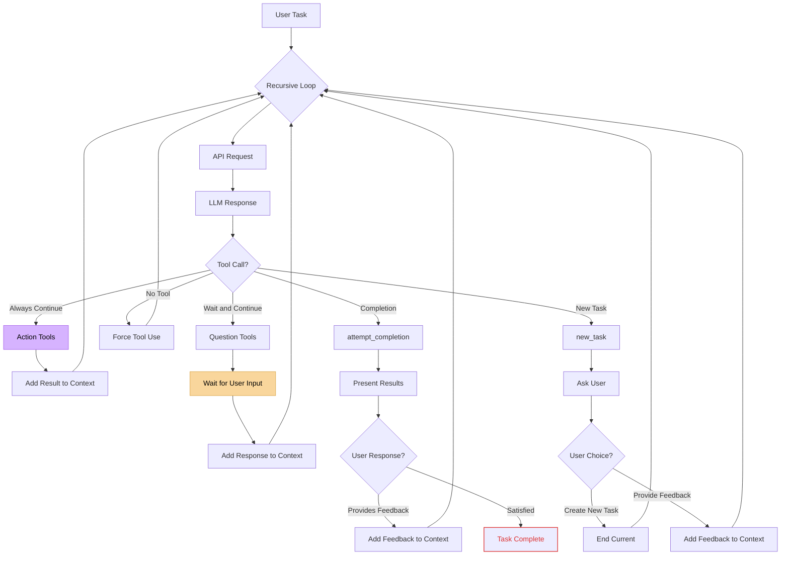

# State-Machine-Style Agent Implementation

This repository contains an implementation of the simple yet powerful state machine agentic algorithm described in [this Twitter post](https://x.com/arafatkatze/status/1970171291295506491), which explains how Cline's agent works.

## The Core Algorithm

The agent operates as a **recursive loop** that continuously processes tool calls until the user is satisfied:

```
User Request → Recursive Loop → Tool Call → Add Result to Context → Loop Back → Repeat
```

The agent classifies every tool call into **4 categories**:

1. **📋 New Task Tools** - Define what needs to be done
2. **🤔 Question Tools** - Ask for clarification (WAIT for user input)
3. **⚡ Action Tools** - Gather context and perform work (ALWAYS continue)
4. **✅ Completion Tools** - Present results and check user satisfaction

## How It Works

### Recursive Loop Architecture

The agent follows this simple but powerful pattern:



### Tool Categories

#### 📋 New Task Tools

- `new_task` - Define and confirm what needs to be done with user

#### 🤔 Question Tools

- `ask_for_clarification` - When stuck or requests are ambiguous (uses `interrupt` for Human-In-The-Loop)
- `confirm_action` - Before potentially risky operations (uses `interrupt` for Human-In-The-Loop)

#### ⚡ Action Tools

- `read_file` - Read and examine file contents
- `list_files` - Explore directory structure
- `search_files` - Find patterns and content across files
- `write_to_file` - Make changes to files (with automatic backups)

#### ✅ Completion Tools

- `attempt_completion` - Present results and check if user is satisfied (uses `interrupt` for Human-In-The-Loop)

### Context Accumulation

The beautiful part is that **context builds naturally** through the recursive loop:

1. **Start**: `[System prompt + Available tools]`
2. **Tool Call**: Agent chooses appropriate tool based on context
3. **Add Result**: Tool result gets added to conversation memory
4. **Loop Back**: Continue with enriched context
5. **Repeat**: Until user is satisfied

Each tool call adds to the conversation memory, making the agent smarter with every iteration.

## Human-In-The-Loop Integration

This implementation uses LangGraph's **interrupt mechanism** for seamless Human-In-The-Loop (HITL) interactions:

- **Question Tools**: Use `interrupt` to pause execution and wait for user clarification
- **Completion Tools**: Use `interrupt` to present results and collect user satisfaction feedback
- **Task Definition**: Use `interrupt` to confirm task definitions with users
- **Seamless Flow**: Interrupts integrate naturally with the recursive loop architecture
- **State Persistence**: Agent state is maintained across interrupt boundaries

The interrupt-based approach ensures that user interactions are properly integrated into the agent's workflow without breaking the recursive loop pattern.

## Running the Demo

```bash
# Clone the repository
git clone git@github.com:christian-bromann/state-machine-agent.git

# Make sure you have OpenAI API key set
export OPENAI_API_KEY="your-key-here"

# Install dependencies
corepack enable
pnpm install

# Run the demo
pnpm start
```

The demo runs 3 scenarios:

1. **Ambiguous request** → NEW TASK → QUESTION → ACTION → COMPLETION
2. **Clear action request** → NEW TASK → ACTION → COMPLETION
3. **Request for summary** → NEW TASK → ACTION → COMPLETION

Each scenario demonstrates different aspects of the recursive loop and tool categories. An example output can be found in [this gist](https://gist.github.com/christian-bromann/07ae625c3c0662996fdd525799955120).
